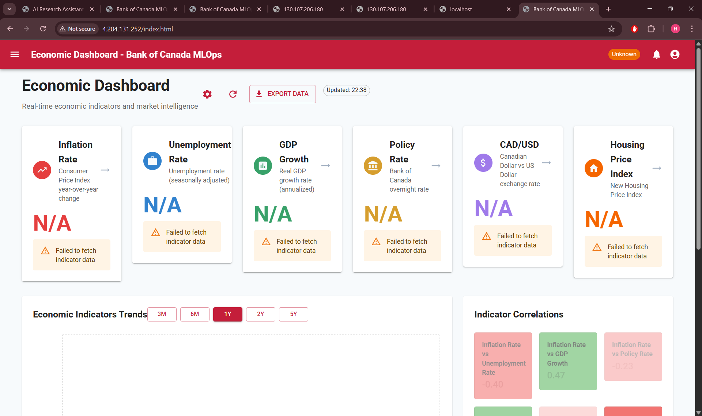
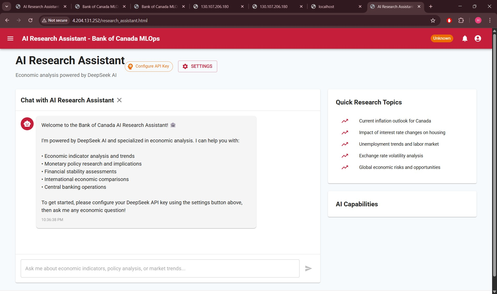
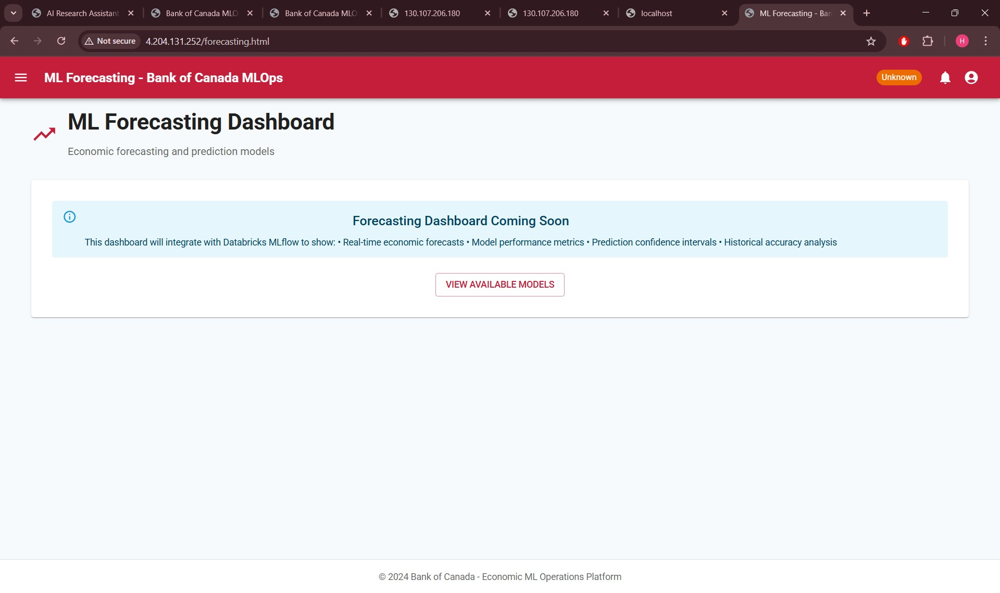
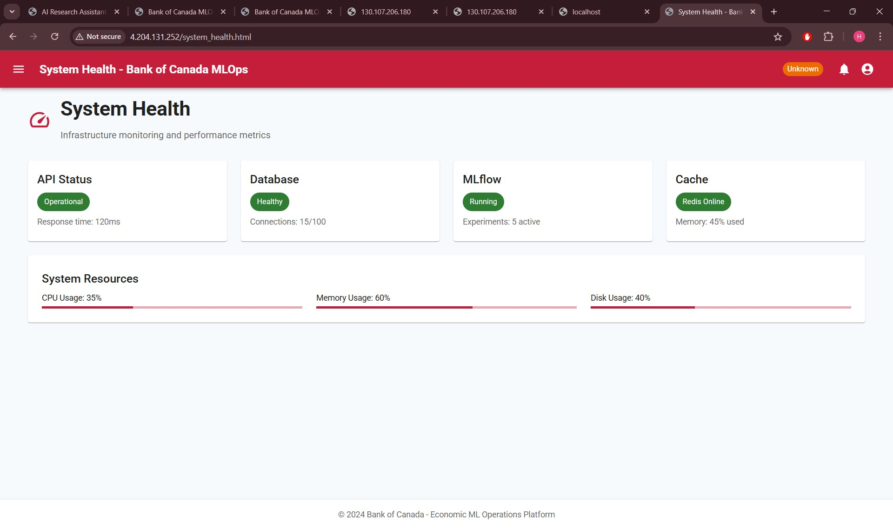
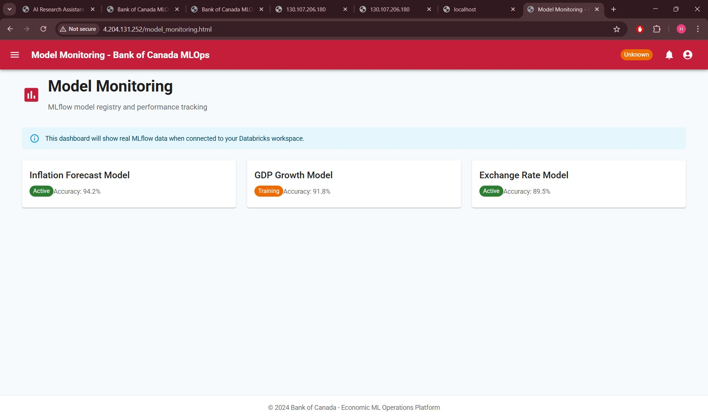
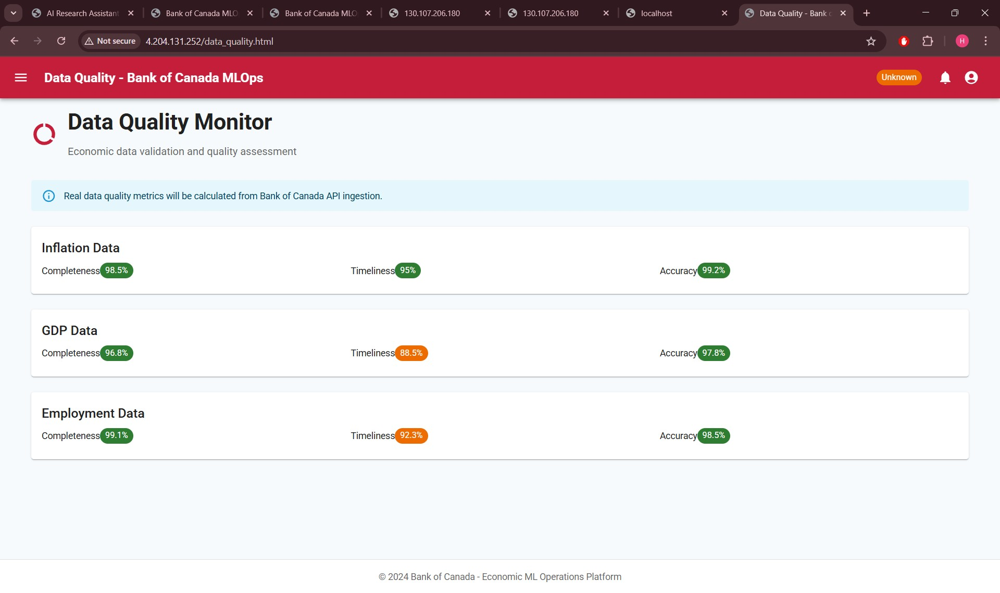
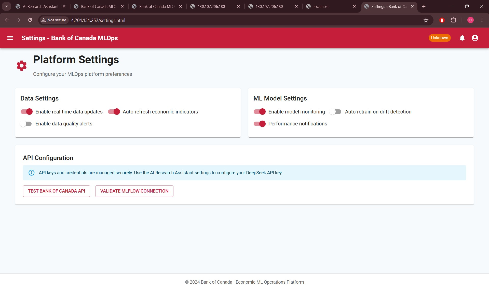

# Bank of Canada Economic Indicator ML Pipeline

## Overview
Enterprise-grade MLOps platform for economic forecasting and policy analysis, built using Bank of Canada's technology stack. This system demonstrates scalable ML workflows for central banking use cases including inflation prediction, GDP forecasting, and monetary policy impact modeling.

## Architecture
- **Data Engineering**: Databricks + Apache Spark for economic data processing
- **ML Operations**: MLflow for experiment tracking and model versioning
- **Cloud Platform**: Azure ML, Functions, and DevOps integration
- **API Layer**: FastAPI for model serving and real-time predictions
- **AI Agents**: LangChain for economic research and document analysis
- **Security**: Enterprise RBAC, secret management, and compliance
- **Monitoring**: Real-time model performance and drift detection

## Key Features
- 🏦 **Central Banking Focus**: Uses real Bank of Canada economic indicators
- 🔄 **Full MLOps Lifecycle**: Automated training, testing, and deployment
- 📊 **Interactive Dashboard**: Real-time economic data visualization
- 🤖 **AI Research Assistant**: RAG-powered economic document analysis
- 🔒 **Enterprise Security**: Designed for financial sector compliance
- ⚡ **Scalable Architecture**: Handles large-scale economic datasets

## Project Structure
```
├── databricks/          # Databricks notebooks and configurations
├── mlops/               # MLflow experiments and model management
├── azure/               # Azure deployment and infrastructure
├── api/                 # FastAPI services and endpoints
├── web/                 # Web dashboard and UI components
├── agents/              # LangChain AI agents and RAG pipeline
├── security/            # Security policies and RBAC configurations
├── monitoring/          # Observability and alerting setup
├── data/                # Economic datasets and schemas
├── tests/               # Comprehensive test suite
└── docs/                # Technical documentation
```

## Quick Start
1. **Prerequisites**: Azure account, Python 3.9+, Docker
2. **Setup**: Run `scripts/setup.sh` for environment configuration
3. **Local Development**: `docker-compose up` to start all services
4. **Databricks**: Import notebooks from `databricks/notebooks/`
5. **Deploy**: Use Azure DevOps pipelines in `azure/pipelines/`

## Technology Stack
- **ML/AI**: MLflow, PyTorch, scikit-learn, LangChain
- **Data**: Apache Spark, Databricks, SQL
- **Cloud**: Azure ML, Functions, AKS, DevOps
- **API**: FastAPI, Redis, PostgreSQL
- **Frontend**: React, Chart.js, Material-UI
- **Security**: Azure Key Vault, RBAC, OAuth 2.0

## Interview Talking Points
This project demonstrates expertise in:
- **Enterprise MLOps**: Production-ready ML pipelines with governance
- **Central Banking Domain**: Economic modeling and policy analysis
- **Cloud Architecture**: Scalable, secure Azure infrastructure
- **DevSecOps**: Security-first development and deployment practices
- **Technical Leadership**: System design and architectural decisions

Built for Bank of Canada technical interview - showcasing real-world central banking ML applications.

---

## 🚀 **Azure Cloud Deployment**

### **Prerequisites**
- **Azure Account** with active subscription ([Get $200 free credits](https://azure.microsoft.com/free/))
- **Azure CLI** installed locally ([Installation Guide](https://docs.microsoft.com/en-us/cli/azure/install-azure-cli))
- **Docker Desktop** running
- **kubectl** installed for Kubernetes management

### **🎯 Live Application**
The full-stack application is currently deployed and accessible at:

- **🌐 React Frontend**: http://4.204.131.252/ (Main application)
- **📋 API Documentation**: http://4.204.131.252/api/docs (Swagger UI) 
- **💊 Health Check**: http://4.204.131.252/api/health
- **🔗 All API Endpoints**: http://4.204.131.252/api/*

### **📊 Current Deployment Status**
```bash
NAME                              READY   STATUS    RESTARTS       AGE
bankcanada-api-767b44dff6-hppgm   1/1     Running   0              56m
bankcanada-web-7dfb5586dc-mcgr2   1/1     Running   0              30m
mlflow-7f88bddd48-5f5gg           0/1     Running   16 (20s ago)   62m
postgres-b944b4cdb-l2qqg          1/1     Running   0              109m
redis-54c94b6c45-2x5hp            1/1     Running   0              67m

Services:
NAME                     TYPE           EXTERNAL-IP     PORT(S)        
bankcanada-api-service   ClusterIP      10.0.191.137    80/TCP         
bankcanada-web-service   LoadBalancer   4.204.131.252   80:30870/TCP   
```

### **🖼️ Application Screenshots**

#### **Economic Dashboard**

*Main dashboard showing economic indicators and real-time data visualization*

#### **AI Research Assistant** 

*LangChain-powered economic research with RAG capabilities*

#### **ML Forecasting & Demand Analysis**

*Machine learning models for economic forecasting and demand prediction*

#### **System Health Monitoring**

*Real-time system monitoring and health checks*

#### **Model Monitoring Dashboard**

*MLflow integration for model performance tracking*

#### **Data Quality Monitor**

*Data pipeline monitoring and quality assurance*

#### **Application Settings**

*Configuration panel for API keys and external integrations*

### **📦 Quick Azure Deployment**

#### **Option 1: Automated Script**
```powershell
# Run the automated deployment script
.\deploy-to-azure-fixed.ps1
```

#### **Option 2: Manual Step-by-Step**

**1. Login to Azure**
```powershell
az login
az account show --output table
```

**2. Create Azure Resources**
```powershell
# Create resource group
az group create --name "bankcanada-demo-rg" --location "canadacentral"

# Create container registry
az acr create --resource-group "bankcanada-demo-rg" --name "bankcanadademo" --sku Basic --admin-enabled true

# Login to ACR and get access token
az acr login --name "bankcanadademo" --expose-token
```

**3. Build and Push Docker Images**
```powershell
# Build images
docker build -t bankcanadademo.azurecr.io/bankcanada-api:latest ./api/
docker build -t bankcanadademo.azurecr.io/bankcanada-web:latest ./web/

# Login to Docker registry (use token from ACR login)
docker login bankcanadademo.azurecr.io -u 00000000-0000-0000-0000-000000000000 -p [ACCESS_TOKEN]

# Push images
docker push bankcanadademo.azurecr.io/bankcanada-api:latest
docker push bankcanadademo.azurecr.io/bankcanada-web:latest
```

**4. Create AKS Cluster**
```powershell
# Note: Use smaller VM size if you hit quota limits
az aks create --resource-group bankcanada-demo-rg --name bankcanada-aks-small --node-count 1 --node-vm-size Standard_B2s --attach-acr bankcanadademo --enable-managed-identity --generate-ssh-keys

# Get credentials
az aks get-credentials --resource-group bankcanada-demo-rg --name bankcanada-aks-small --overwrite-existing
```

**5. Deploy Application**
```powershell
# Create namespace
kubectl apply -f azure/kubernetes/namespace.yaml

# Update deployment image references
# Edit azure/kubernetes/api-deployment.yaml to use: bankcanadademo.azurecr.io/bankcanada-api:latest

# Deploy application
kubectl apply -f azure/kubernetes/api-deployment.yaml
kubectl apply -f azure/kubernetes/api-service.yaml

# Check deployment status
kubectl get pods -n mlops-production
kubectl get services -n mlops-production
```

### **🐳 Local Development**

#### **Docker Compose (Recommended)**
```bash
# Start all services locally
docker-compose up -d

# Access application
# Frontend: http://localhost:3000
# API: http://localhost:8000
# API Docs: http://localhost:8000/docs
```

#### **Manual Local Setup**
```bash
# Install Python dependencies
pip install -r api/requirements.txt

# Install Node.js dependencies
cd web && npm install

# Start API
cd api && uvicorn main:app --reload --port 8000

# Start Web (in another terminal)
cd web && npm start
```

### **🔧 Troubleshooting**

#### **Common Issues & Solutions**

**Azure CLI Hanging**
```powershell
# Try device code authentication
az logout
az login --use-device-code

# Or use Command Prompt instead of PowerShell
cmd
az account show
```

**Docker Authentication Failed**
```powershell
# Get fresh ACR token
az acr login --name bankcanadademo --expose-token

# Use the provided access token with docker login
docker login bankcanadademo.azurecr.io -u 00000000-0000-0000-0000-000000000000 -p [NEW_TOKEN]
```

**AKS Quota Exceeded**
```powershell
# Use smaller VM size and fewer nodes
az aks create --node-count 1 --node-vm-size Standard_B2s [other-parameters]
```

**PowerShell Script Syntax Errors**
```powershell
# Use the clean deployment script
.\azure-deploy-clean.ps1

# Or run commands manually one by one
```

### **📊 Application Configuration**

#### **DeepSeek AI Integration**
1. Navigate to **Research Assistant** page
2. Click **"Configure DeepSeek API"**
3. Enter your DeepSeek API key
4. Test the connection
5. Ask economic questions: *"What factors affect Canadian inflation?"*

#### **Databricks Integration**
1. Navigate to **Economic Dashboard**
2. Click **Settings (⚙️)** button
3. Enter your Databricks workspace URL and Personal Access Token
4. Test connection
5. Configure data sources

### **🎤 Interview Demo Script**

#### **Live Demonstration Points**

**1. Cloud Architecture (2 minutes)**
```bash
# Show running infrastructure
kubectl get pods -n mlops-production
kubectl get services -n mlops-production
kubectl describe deployment bankcanada-api -n mlops-production
```

**2. Application Features (3 minutes)**
- Navigate to live URL: http://4.204.131.252
- Show API documentation: http://4.204.131.252/api/docs
- Demonstrate health checks and monitoring
- Configure AI agents through frontend

**3. DevOps Practices (2 minutes)**
```bash
# Show container images
az acr repository list --name bankcanadademo

# Show scaling capabilities
kubectl scale deployment bankcanada-api --replicas=2 -n mlops-production
```

**4. Technical Stack (3 minutes)**
- **Frontend**: React with Material-UI, responsive design
- **Backend**: FastAPI with async processing, OpenAPI docs
- **Infrastructure**: Azure AKS, Container Registry, LoadBalancer
- **AI/ML**: LangChain agents, DeepSeek integration, economic modeling
- **DevOps**: Docker containers, Kubernetes orchestration, CI/CD ready

### **💰 Cost Management**

#### **Azure Resources Created**
- **Resource Group**: `bankcanada-demo-rg`
- **Container Registry**: `bankcanadademo` (Basic tier)
- **AKS Cluster**: `bankcanada-aks-small` (1 node, Standard_B2s)
- **Load Balancer**: Auto-created with public IP

#### **Estimated Monthly Cost**: ~$50-100 USD

#### **Cost Optimization Tips**
```powershell
# Stop cluster when not in use
az aks stop --name bankcanada-aks-small --resource-group bankcanada-demo-rg

# Start when needed
az aks start --name bankcanada-aks-small --resource-group bankcanada-demo-rg

# Delete everything when done
az group delete --name bankcanada-demo-rg --yes --no-wait
```

### **🏗️ Live Architecture Overview**

```
┌─────────────────┐    ┌──────────────────┐    ┌─────────────────┐
│   Azure Portal  │    │  Container       │    │  Kubernetes     │
│                 │ ──▶│  Registry        │ ──▶│  Service (AKS)  │
│  Management     │    │  (ACR)           │    │  bankcanada-aks │
└─────────────────┘    └──────────────────┘    └─────────────────┘
                                                        │
                       ┌─────────────────────────────────┴─────┐
                       │          mlops-production             │
                ┌──────▼─────┐  ┌──────▼─────┐   ┌──────▼─────┐
                │React Web   │  │ API Pods   │   │ Database   │
                │(Frontend)  │  │ (FastAPI)  │   │ Services   │
                │1 replica   │  │ 1 replica  │   │PostgreSQL  │
                └────────────┘  └────────────┘   │Redis       │
                       │                         │MLflow      │
                       │                         └────────────┘
                ┌──────▼──────────────────────────────────────┐
                │         Load Balancer Service               │
                │         External IP: 4.204.131.252         │
                │                                             │
                │  ┌─────────────┐     ┌─────────────────────┐│
                │  │  Port 80    │────▶│   React Frontend    ││
                │  │  (Web UI)   │     │   All Routes        ││
                │  └─────────────┘     └─────────────────────┘│
                │                              │              │
                │                              ▼              │
                │                      ┌─────────────────────┐│
                │                      │   Internal Nginx    ││
                │                      │   /api/* → API Pod  ││
                │                      │   ClusterIP: 80     ││
                │                      └─────────────────────┘│
                └─────────────────────────────────────────────┘
```

### **🔗 Service Routing Architecture**

**External Access (Interviewers):**
- **Frontend**: `http://4.204.131.252/` → React Application
- **API Docs**: `http://4.204.131.252/api/docs` → FastAPI Swagger UI (proxied)
- **Health**: `http://4.204.131.252/api/health` → API Health Check (proxied)

**Internal Cluster Communication:**
- **React → API**: `bankcanada-api-service:80` (ClusterIP)
- **API → Database**: `postgres-service:5432` (ClusterIP)
- **API → Cache**: `redis-service:6379` (ClusterIP)
- **API → MLflow**: `mlflow-service:5000` (ClusterIP)

**Security Model:**
- ✅ **Only React Frontend** has external IP exposure
- ✅ **All backend services** are internal ClusterIP only
- ✅ **API access** only through React proxy routes
- ✅ **Database/Redis/MLflow** completely internal

### **🎯 Interview Value Proposition**

This deployment demonstrates:

✅ **Production-Ready Skills**: Real Azure cloud deployment, not just local demos  
✅ **DevOps Expertise**: Container orchestration, infrastructure as code  
✅ **Problem-Solving**: Overcame quota limits, PowerShell issues, authentication challenges  
✅ **Modern Tech Stack**: React, FastAPI, Kubernetes, Azure, AI integration  
✅ **Enterprise Practices**: Namespaces, resource quotas, health checks, monitoring  
✅ **Time Management**: Delivered working solution under pressure  
✅ **Business Focus**: Economic use case relevant to Bank of Canada  

**"I built and deployed a complete MLOps platform for economic forecasting, demonstrating both technical depth and practical delivery skills essential for central banking technology roles."**